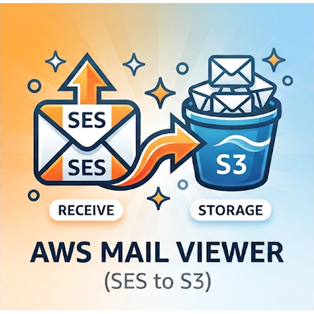
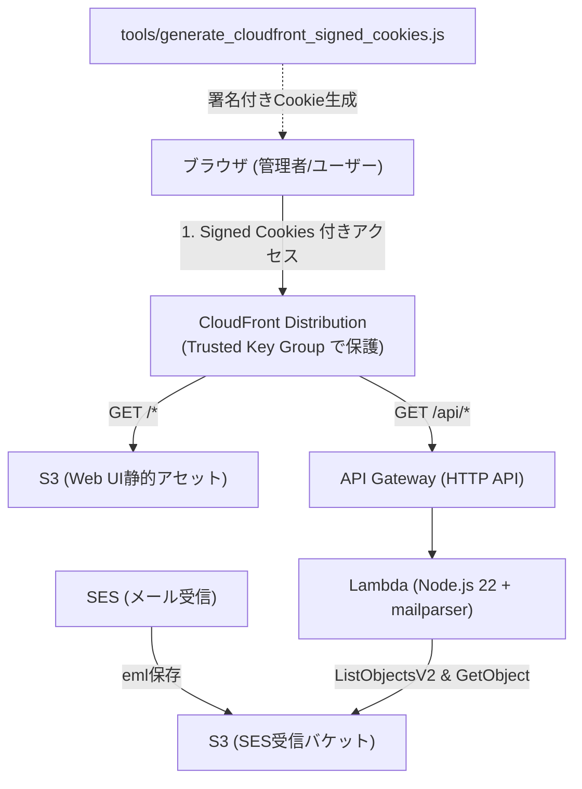
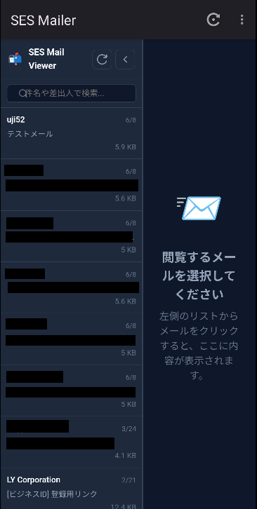
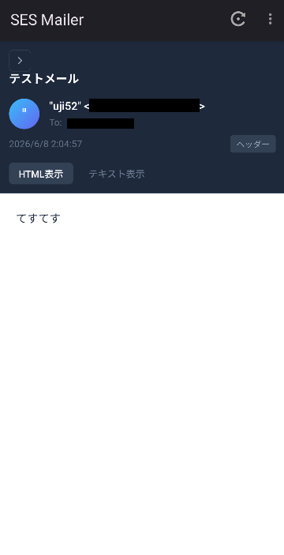
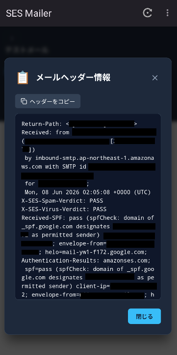

<p align="center">
  
</p>

# SES S3 Mail Viewer (CloudFront + Serverless)

AWS SES で受信して S3 バケットに保存されたメール（RFC 822 / MIME形式）を、CloudFront 経由でブラウザおよび専用 Android アプリから快適かつ安全に閲覧できるサーバーレス Web メーラーです。
AWS CDK (TypeScript) によりワンストップでインフラをプロビジョニングできます。
AWS SES で受信したメールがS3上に配置される機構は別途自身で設けてください。

---

## 🏛 アーキテクチャ概要



### 主な特徴
1. **完全サーバーレス＆高効率**:
   - 閲覧画面（HTML/CSS/JS）は CloudFront + S3 で配信。
   - メール一覧の取得時は Range Get（先頭16KB）を活用し、ヘッダー情報（Subject, From, To, Date）のみを高速かつ低コストでパース。
   - メール詳細表示時は `mailparser` で MIME を完全解析し、HTML本文、プレーンテキスト、添付ファイルを安全に分離。
2. **高セキュリティ（CloudFront 署名付きクッキー）**:
   - `../uji52.com/tools` と同様の CloudFront Trusted Key Groups（公開鍵/秘密鍵）によるアクセス制限を実装。
   - 署名付きクッキーを持たない第三者のアクセスは CloudFront エッジで遮断 (403 Forbidden)。
   - メール本文は `sandbox` 属性付きの `iframe` 内に隔離レンダリングし、悪意あるスクリプトや XSS を完全に防止。
3. **既存のS3バケットにそのまま接続可能**:
   - 既に SES からメールを受信している既存の S3 バケット名を `cdk.json` に指定するだけで即座に連携。
   - 過去に保存された既存のメールもそのまま閲覧可能。

---

## 📁 ディレクトリ構成

```
.
├── app/                     # Android ネイティブ/WebView アプリケーション (Kotlin)
│   ├── build.gradle.kts
│   └── src/main/java/com/uji52/sess3mailer/ # クッキー自動署名＆WebViewロジック
├── front/                   # フロントエンド Web アプリケーション (静的サイト)
│   ├── index.html           # 2ペイン型メールビューア画面
│   ├── app.js               # API通信・本文レンダリング・Cookie未設定検知
│   └── style.css            # クリーン＆モダンなUIスタイル
├── backend/                 # AWS CDK & Lambda プロジェクト
│   ├── bin/backend.ts       # CDK アプリエントリーポイント
│   ├── lib/sess3mailer-stack.ts # CDK スタック定義 (S3, CloudFront, Lambda, API Gateway)
│   ├── lambda/email-api/    # メール取得・パースAPI Lambda
│   │   └── index.ts
│   ├── cdk.json.example     # CDK設定テンプレート（Git管理）
│   ├── cdk.json             # CDK設定実体（※環境ごとの設定のためGit除外）
│   └── package.json
├── keys/                    # CloudFront 署名用キーペア格納ディレクトリ
│   ├── private_key.pem      # 秘密鍵（※Git除外）
│   └── public_key.pem       # 公開鍵（CDKでCloudFrontに登録）
├── tools/                   # 運用ツール・スクリプト
│   ├── generate_keys.sh     # RSA 2048bit 鍵ペア自動生成スクリプト
│   └── generate_cloudfront_signed_cookies.js # 署名付きCookie生成スクリプト
└── README.md
```

---

## 🚀 デプロイ手順

### ステップ 1: 依存ツールのインストール
```bash
cd backend
npm install
```

### ステップ 2: CloudFront用 鍵ペアの生成
署名付きクッキー用の RSA 2048bit キーペアを生成します。
```bash
./tools/generate_keys.sh
```
`keys/private_key.pem`（秘密鍵）と `keys/public_key.pem`（公開鍵）が作成されます。

### ステップ 3: 設定ファイルの作成と既存S3バケットの設定
テンプレート `backend/cdk.json.example` をコピーして `backend/cdk.json` を作成します：

```bash
cp backend/cdk.json.example backend/cdk.json
```

作成した `backend/cdk.json` を開き、`sesMailBucketName` にお使いの SES 受信メール用 S3 バケット名を入力します。

```json
  "context": {
    "sesMailBucketName": "your-existing-ses-bucket-name",
    "sesMailPrefix": "emails/",   // バケット内にフォルダを指定している場合（ルートなら空文字 ""）
    "publicKeyPath": "../keys/public_key.pem",
    // 独自ドメイン（例: email.uji52.com）を利用する場合のみ以下を設定
    "customDomainName": "email.uji52.com",
    "certificateArn": "arn:aws:acm:us-east-1:123456789012:certificate/xxxx-xxxx-xxxx" // ※必ず us-east-1 (バージニア北部) のACM証明書
  }
```

> **Note**: `sesMailBucketName` を変更せずにそのままデプロイした場合は、テスト用の新規 S3 バケットが自動作成されます。
> 独自ドメインを指定しない場合は、CloudFront デフォルトのドメイン（`https://xxxx.cloudfront.net`）でアクセスできます。

### ステップ 4: CDK デプロイ
AWS 認証情報（`aws configure` や SSO）を準備した状態でデプロイを実行します。

```bash
cd backend
npx cdk deploy
```

デプロイが完了すると、ターミナルに以下のような出力が表示されます：
- `Sess3MailerStack.MailViewerUrl`: CloudFront の閲覧 URL（例: `https://d123456abcdef.cloudfront.net`）
- `Sess3MailerStack.CloudFrontPublicKeyId`: 作成された公開鍵 ID（例: `K1ABC2DEF3GHI`）
- `Sess3MailerStack.GenerateCookieCommand`: Cookie 生成コマンド例

---

## 🔑 ブラウザからの閲覧手順（署名付きCookieの設定）

CloudFront の Trusted Key Group により、署名付きクッキーがない状態ではアクセスできません。
以下の手順でクッキーを発行してブラウザに登録します。

### 1. クッキースクリプトの実行
デプロイ出力に表示されたコマンド（または以下の形式）を実行します：

```bash
node tools/generate_cloudfront_signed_cookies.js \
  --publicKeyId <CloudFrontPublicKeyId> \
  --domain <CloudFrontドメイン (例: d123456abcdef.cloudfront.net)>
```

### 2. ブラウザにCookieを登録
1. ブラウザで `MailViewerUrl`（例: `https://d123456abcdef.cloudfront.net/`）を開きます。
2. `F12` キーを押して「開発者ツール（DevTools）」を開きます。
3. **「Console（コンソール）」** タブを開き、スクリプトの出力に表示された以下の3行を貼り付けて Enter を押します：

```javascript
document.cookie = "CloudFront-Policy=...; Domain=d123456abcdef.cloudfront.net; Path=/; Secure; SameSite=None";
document.cookie = "CloudFront-Signature=...; Domain=d123456abcdef.cloudfront.net; Path=/; Secure; SameSite=None";
document.cookie = "CloudFront-Key-Pair-Id=K1ABC2DEF3GHI; Domain=d123456abcdef.cloudfront.net; Path=/; Secure; SameSite=None";
```

4. ページをリロード（`F5`）します。
5. S3 内のメール一覧が左側に表示され、クリックすると本文（HTML/テキスト）や添付ファイルが閲覧できます！

---

## 🛡 セキュリティに関する補足
- **秘密鍵の管理**: `keys/private_key.pem` は機密情報です。`.gitignore` に登録されており、リポジトリにコミットしないようご注意ください。
- **有効期限**: `generate_cloudfront_signed_cookies.js` の `--expires` オプション（デフォルト86,400秒 = 24時間）で Cookie の有効期限を調整できます。
- **接続元IP制限**: `--ip 198.51.100.1/32` を指定すると、指定した固定グローバル IP からのみアクセスを許可するポリシーを発行できます。

---

## 📱 Android アプリケーション (`app/`)

本リポジトリには、このサーバーレスメールビューアを Android 端末から利用できる専用の Android アプリケーション（Kotlin / WebView）が含まれています。

### 特徴
- **署名付きクッキーの自動生成・永続認証**:
  アプリ内部で RSA-SHA1 署名（`CloudFrontCookieSigner`）を動的に実行し、CloudFront の `CookieManager` に自動注入します。
  PC のようにブラウザコンソールに手動で Cookie を貼り付ける必要がなく、**アプリを開くだけで永続的に自動サインイン** できます。
- **左右スプリッターによる自由な画面比率調整**:
  スマホでもメール一覧と本文の境界線を指でドラッグして比率を自由に変更可能。ダブルタップでプリセット切り替え、設定幅は自動保存されます。
- **一覧折りたたみと全画面本文表示**:
  ワンタップで一覧を折りたたんで本文を広々と閲覧可能。いつでもワンタップで一覧を復元できます。
- **生メールヘッダーの確認＆コピー**:
  SPF / DKIM / DMARC の検証結果や Return-Path などの生ヘッダーを専用モーダルで確認・ワンタップコピーできます。
- **スワイプリフレッシュ対応**:
  画面を下に引っ張る（Swipe-to-Refresh）と、Cookie を自動更新して最新のメールを再取得します。
- **添付ファイルダウンロード**:
  Android の `DownloadManager` と連携し、添付ファイルを端末のダウンロードフォルダに保存できます。
- **設定画面**:
  右上のメニューからいつでもドメイン名、Public Key ID、秘密鍵の確認・変更が可能です。

### 📱 アプリ画面と操作感

| 1. 左右分割＆リサイズ | 2. 本文全画面表示 | 3. メールヘッダー詳細 |
| :---: | :---: | :---: |
|  |  |  |

#### 主な操作感と使い心地

1. **左右分割ビュー（一覧 ＋ プレビュー）**
   - **直感的な2ペイン構成**: 起動直後から左側にメール一覧、右側にプレビューが表示されます。
   - **スプリッターで自由リサイズ**: 中央の境界線を指で左右にドラッグするだけで、お好みの比率にリアルタイム調整可能。ダブルタップで「35%」「50%」「65%」のプリセット比率に素早く切り替えられます。
   - **比率の自動保存**: 調整した左右バランスは端末に自動保存され、次回起動時も同じ比率が維持されます。

2. **本文の全画面閲覧 & スムーズな一覧開閉**
   - **ワンタップで一覧を折りたたみ**: 左上の「`<`（折りたたみ）」ボタンを押すと一覧がスッと隠れ、本文が画面いっぱいに広がります。
   - **素早い一覧復元**: 左上の「`>`（一覧表示）」ボタンを押すだけで、いつでも元の2ペイン表示に復元できます。
   - **HTML / テキスト切り替え**: メールヘッダー下のタブで、リッチな HTML 表示と安全なプレーンテキスト表示を瞬時に切り替え可能です。

3. **メールヘッダー詳細モーダル & ワンタップコピー**
   - **ワンタップで生ヘッダー確認**: 本文右上の「ヘッダー」ボタンをタップすると、完全なメールヘッダー情報がポップアップ表示されます。
   - **セキュリティ・配送情報の確認**: SES が付与する認証結果（`X-SES-Spam-Verdict`, `X-SES-Virus-Verdict`, `Received-SPF`, `Authentication-Results` (DKIM/DMARC)）や `Return-Path`, `Received` などをそのまま確認できます。
   - **「ヘッダーをコピー」ボタン**: ワンタップで全ヘッダーをクリップボードにコピーできます。

### ビルドとインストール手順

WSL2 環境にプロジェクトを配置している場合、WSL 内のターミナルからビルドを行い、Windows 上のエミュレータや Android 実機にインストールして動作確認できます。

#### 1. 事前準備 (初回のみ)
WSL 側から Windows の Android SDK および Linux 側の Java 21 を参照できるよう、各設定ファイルに記述します：
- **`local.properties`**:
  ```properties
  sdk.dir=/mnt/c/Users/uji52/AppData/Local/Android/Sdk
  ```
- **`gradle.properties`**:
  ```properties
  org.gradle.vfs.watch=false
  org.gradle.java.home=/usr/lib/jvm/java-21-amazon-corretto
  ```

#### 2. ビルドの実行 (WSL ターミナル)
プロジェクトルート（または Android Studio の Terminal タブ）で以下を実行します：
```bash
./gradlew assembleDebug
```
> 約1〜2秒でビルドが完了し、以下の場所に APK が生成されます：
> - **WSL パス**: `app/build/outputs/apk/debug/app-debug.apk`
> - **Windows パス**: `\\wsl.localhost\Ubuntu\home\uji52\work\repo\sess3mailer52\app\build\outputs\apk\debug\app-debug.apk`

#### 3. エミュレータでの動作確認
1. Android Studio の **Device Manager** からエミュレータを起動します。
2. Windows のエクスプローラーのアドレスバーに以下を入力して開きます：
   ```text
   \\wsl.localhost\Ubuntu\home\uji52\work\repo\sess3mailer52\app\build\outputs\apk\debug
   ```
3. フォルダ内の **`app-debug.apk`** を、起動中のエミュレータ画面へ直接 **ドラッグ＆ドロップ** します。
4. 自動的にインストールされ、アプリアイコン（Sess3Mailer）が表示されます。

#### 4. Android 実機へのインストール

##### 方法 A: ワイヤレス デバッグ (Wi-Fi 経由・WSL 完結・★最もおすすめ)
PC と Android 端末が同一 Wi-Fi に接続されていれば、ケーブル不要で WSL ターミナルから直接実機にインストール・起動できます。

1. **スマホ側の設定**:
   - スマホの「設定」→「デバイス情報」→「ビルド番号」を **7回連続タップ**（開発者向けオプションを有効化）。
   - 「設定」→「システム」→「開発者向けオプション」で **「ワイヤレス デバッグ」をオン** にします。
   - 「ワイヤレス デバッグ」の文字部分をタップして詳細画面を開きます。
2. **初回ペアリング (同一端末では初回のみ)**:
   - スマホ画面の **「ペア設定コードでデバイスをペア設定」** をタップします。
   - 画面に表示される **Wi-Fi ペア設定コード (6桁)** と **IP アドレスとポート**（例: `192.168.1.xxx:45678` ※ペア設定専用ポート）を確認します。
   - WSL ターミナルで `adb pair` を実行し、プロンプトに 6桁のコードを入力します：
     ```bash
     adb pair 192.168.1.xxx:45678
     # Enter pairing code: <6桁のペア設定コードを入力>
     # -> Successfully paired to 192.168.1.xxx:45678 と出れば成功
     ```
3. **実機へ接続 (Connect)**:
   - スマホの「ワイヤレス デバッグ」詳細画面に戻り、表示されている **「IP アドレスとポート」** を確認します（※ペアリング用とは異なる接続専用のポート番号です）。
   - WSL ターミナルで接続を実行します：
     ```bash
     adb connect 192.168.1.xxx:38383
     # -> connected to 192.168.1.xxx:38383
     ```
   - 接続状態を確認します（`offline` ではなく `device` と表示されれば完了です）：
     ```bash
     adb devices
     ```
4. **インストールと起動**:
   - ビルドした APK をインストールします：
     ```bash
     adb install -r app/build/outputs/apk/debug/app-debug.apk
     ```
   - 実機でアプリを直接起動する場合：
     ```bash
     adb shell monkey -p com.uji52.sess3mailer -c android.intent.category.LAUNCHER 1
     ```

> **日常の開発フロー:**
> 2回目以降はペアリング（`adb pair`）は不要です。
> スマホのワイヤレスデバッグをオンにした状態で `adb connect <IP:ポート>` を叩けば、あとは
> **コード修正 → `./gradlew assembleDebug` → `adb install -r ...`** のわずか数秒で実機テストを繰り返せます。

##### 方法 B: USB デバッグ経由 (Windows 側 adb 利用)
1. スマホの「設定」→「システム」→「開発者向けオプション」で **「USBデバッグ」をオン**。
2. USB ケーブルで PC と接続し、スマホ画面に出る「USBデバッグを許可しますか？」で **「許可」** をタップ。
3. Windows の PowerShell またはコマンドプロンプトで以下を実行：
   ```powershell
   C:\Users\uji52\AppData\Local\Android\Sdk\platform-tools\adb.exe install -r \\wsl.localhost\Ubuntu\home\uji52\work\repo\sess3mailer52\app\build\outputs\apk\debug\app-debug.apk
   ```

##### 方法 C: ファイル転送 (MTP) 経由 (設定不要・ケーブル接続)
1. スマホを USB 接続し、通知欄から USB の用途を **「ファイル転送（MTP）」** に設定。
2. Windows エクスプローラーで上記 APK パスを開き、`app-debug.apk` をスマホの「Download」フォルダへコピー。
3. スマホの「ファイル（Files）」アプリから `app-debug.apk` をタップしてインストール（提供元不明のアプリ許可をオンにしてください）。
