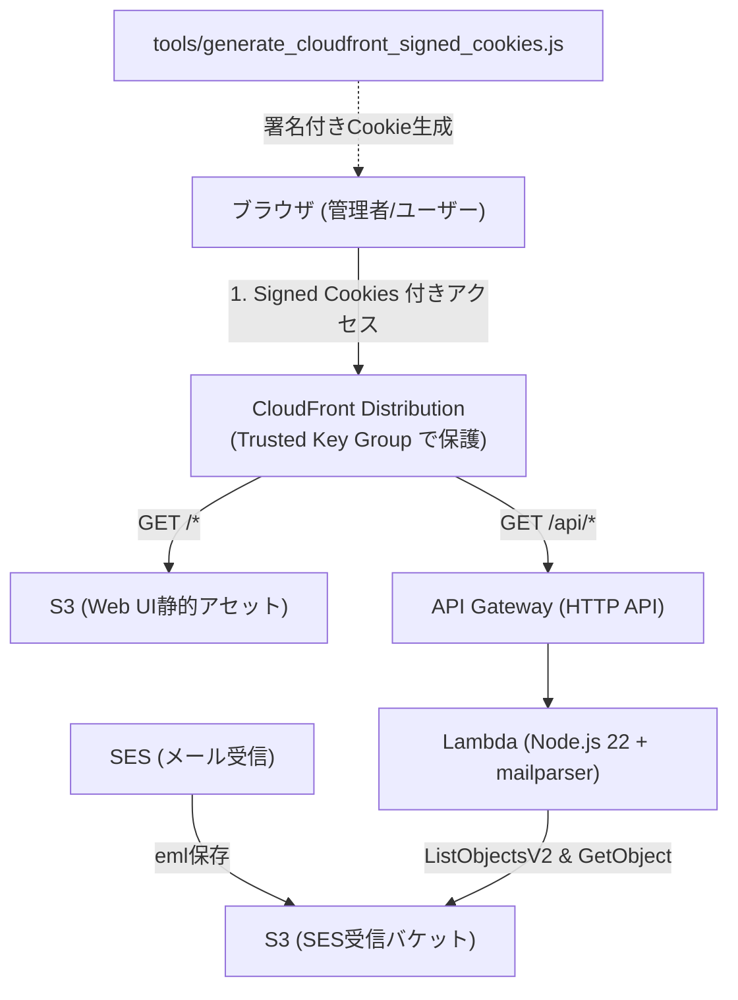

# SES S3 Mail Viewer (CloudFront + Serverless)

AWS SES で受信して S3 バケットに保存されたメール（RFC 822 / MIME形式）を、CloudFront 経由でブラウザから快適かつ安全に閲覧できるサーバーレス Web メーラーです。
AWS CDK (TypeScript) によりワンストップでインフラをプロビジョニングできます。

---

## 🏛 アーキテクチャ概要



### 主な特徴
1. **完全サーバーレス＆高効率**:
   - 閲覧画面（HTML/CSS/JS）は CloudFront + S3 で配信。
   - メール一覧の取得時は Range Get（先頭16KB）を活用し、ヘッダー情報（Subject, From, To, Date）のみを高速かつ低コストでパース。
   - メール詳細表示時は `mailparser` で MIME を完全解析し、HTML本文、プレーンテキスト、添付ファイルを安全に分離。
2. **高セキュリティ（CloudFront 署名付きクッキー）**:
   - `../uji52.com/tools` と同様の CloudFront Trusted Key Groups（公開鍵/秘密鍵）によるアクセス制限を実装。
   - 署名付きクッキーを持たない第三者のアクセスは CloudFront エッジで遮断 (403 Forbidden)。
   - メール本文は `sandbox` 属性付きの `iframe` 内に隔離レンダリングし、悪意あるスクリプトや XSS を完全に防止。
3. **既存のS3バケットにそのまま接続可能**:
   - 既に SES からメールを受信している既存の S3 バケット名を `cdk.json` に指定するだけで即座に連携。
   - 過去に保存された既存のメールもそのまま閲覧可能。

---

## 📁 ディレクトリ構成

```
.
├── app/                     # フロントエンド Web アプリケーション (静的サイト)
│   ├── index.html           # 2ペイン型メールビューア画面
│   ├── app.js               # API通信・本文レンダリング・Cookie未設定検知
│   └── style.css            # クリーン＆モダンなUIスタイル
├── backend/                 # AWS CDK & Lambda プロジェクト
│   ├── bin/backend.ts       # CDK アプリエントリーポイント
│   ├── lib/sess3mailer-stack.ts # CDK スタック定義 (S3, CloudFront, Lambda, API Gateway)
│   ├── lambda/email-api/    # メール取得・パースAPI Lambda
│   │   └── index.ts
│   ├── cdk.json             # CDK設定（S3バケット名・プレフィックス等の定義）
│   └── package.json
├── keys/                    # CloudFront 署名用キーペア格納ディレクトリ
│   ├── private_key.pem      # 秘密鍵（※Git除外）
│   └── public_key.pem       # 公開鍵（CDKでCloudFrontに登録）
├── tools/                   # 運用ツール・スクリプト
│   ├── generate_keys.sh     # RSA 2048bit 鍵ペア自動生成スクリプト
│   └── generate_cloudfront_signed_cookies.js # 署名付きCookie生成スクリプト
└── README.md
```

---

## 🚀 デプロイ手順

### ステップ 1: 依存ツールのインストール
```bash
cd backend
npm install
```

### ステップ 2: CloudFront用 鍵ペアの生成
署名付きクッキー用の RSA 2048bit キーペアを生成します。
```bash
./tools/generate_keys.sh
```
`keys/private_key.pem`（秘密鍵）と `keys/public_key.pem`（公開鍵）が作成されます。

### ステップ 3: 既存のS3バケット名を設定
`backend/cdk.json` を開き、`sesMailBucketName` にお使いの SES 受信メール用 S3 バケット名を入力します。

```json
  "context": {
    "sesMailBucketName": "your-existing-ses-bucket-name",
    "sesMailPrefix": "emails/",   // バケット内にフォルダを指定している場合（ルートなら空文字 ""）
    "publicKeyPath": "../keys/public_key.pem"
  }
```

> **Note**: `sesMailBucketName` を変更せずにそのままデプロイした場合は、テスト用の新規 S3 バケットが自動作成されます。

### ステップ 4: CDK デプロイ
AWS 認証情報（`aws configure` や SSO）を準備した状態でデプロイを実行します。

```bash
cd backend
npx cdk deploy
```

デプロイが完了すると、ターミナルに以下のような出力が表示されます：
- `Sess3MailerStack.MailViewerUrl`: CloudFront の閲覧 URL（例: `https://d123456abcdef.cloudfront.net`）
- `Sess3MailerStack.CloudFrontPublicKeyId`: 作成された公開鍵 ID（例: `K1ABC2DEF3GHI`）
- `Sess3MailerStack.GenerateCookieCommand`: Cookie 生成コマンド例

---

## 🔑 ブラウザからの閲覧手順（署名付きCookieの設定）

CloudFront の Trusted Key Group により、署名付きクッキーがない状態ではアクセスできません。
以下の手順でクッキーを発行してブラウザに登録します。

### 1. クッキースクリプトの実行
デプロイ出力に表示されたコマンド（または以下の形式）を実行します：

```bash
node tools/generate_cloudfront_signed_cookies.js \
  --publicKeyId <CloudFrontPublicKeyId> \
  --domain <CloudFrontドメイン (例: d123456abcdef.cloudfront.net)>
```

### 2. ブラウザにCookieを登録
1. ブラウザで `MailViewerUrl`（例: `https://d123456abcdef.cloudfront.net/`）を開きます。
2. `F12` キーを押して「開発者ツール（DevTools）」を開きます。
3. **「Console（コンソール）」** タブを開き、スクリプトの出力に表示された以下の3行を貼り付けて Enter を押します：

```javascript
document.cookie = "CloudFront-Policy=...; Domain=d123456abcdef.cloudfront.net; Path=/; Secure; SameSite=None";
document.cookie = "CloudFront-Signature=...; Domain=d123456abcdef.cloudfront.net; Path=/; Secure; SameSite=None";
document.cookie = "CloudFront-Key-Pair-Id=K1ABC2DEF3GHI; Domain=d123456abcdef.cloudfront.net; Path=/; Secure; SameSite=None";
```

4. ページをリロード（`F5`）します。
5. S3 内のメール一覧が左側に表示され、クリックすると本文（HTML/テキスト）や添付ファイルが閲覧できます！

---

## 🛡 セキュリティに関する補足
- **秘密鍵の管理**: `keys/private_key.pem` は機密情報です。`.gitignore` に登録されており、リポジトリにコミットしないようご注意ください。
- **有効期限**: `generate_cloudfront_signed_cookies.js` の `--expires` オプション（デフォルト86,400秒 = 24時間）で Cookie の有効期限を調整できます。
- **接続元IP制限**: `--ip 198.51.100.1/32` を指定すると、指定した固定グローバル IP からのみアクセスを許可するポリシーを発行できます。
